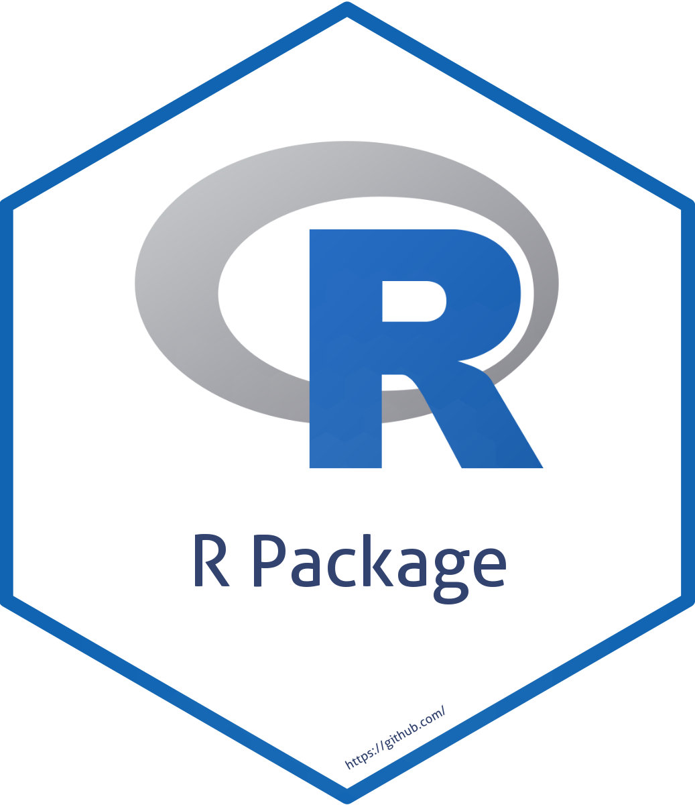
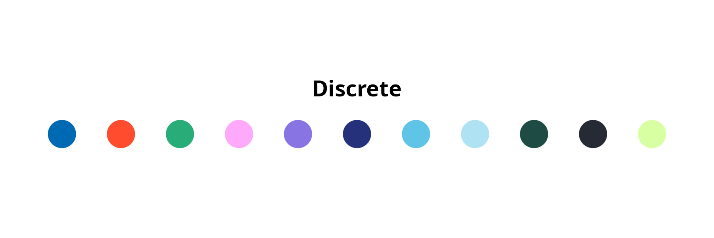
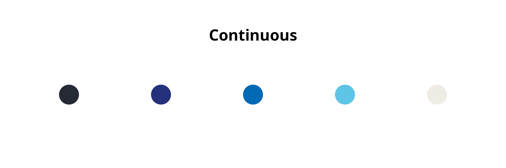
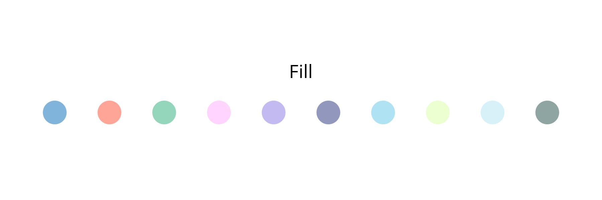

<!-- README.md is generated from README.Rmd. Please edit that file -->

# rogfktheme 

<!-- badges: start -->

<!-- badges: end -->

• <a href="#overview">Overview</a>  •
<a href="#features">Features</a>  •
<a href="#installation">Installation</a>  •
<a href="#get-started">Get started</a>  •
<a href="#long-form-documentations">Long-form documentations</a>  •
<a href="#citation">Citation</a>  •

## Oversikt

R pakken `rogfktheme` er et "theme" med en fargepalett hentet fra/inspirert av
  fylkeskommunenes grafiske anbefalinger og ggplot theme med minimale og
  objektivt optimale instillinger. Pakken inkluderer også et quarto theme som
  kan brukes ved å inkludere følgende i yamlen:
  format:
    html:
      theme:
        - package:rogfktheme/themes/rogfk.scss

**NB:** Krever at RogFKs font
"[Apercu](https://fontforfree.com/apercu-font-family/)" er innstallert.

## Features

Pakken gir **fargepaletter** for kontrasterende farger for diskre/kategori data,
kontinuerlig data (antall nyanser tilpasses automatisk) og pastell-variant av
fargepletten som egner seg til å fylle flater med ønsket farge.

Den gir også et **ggplot theme** med fornuftige og minimale settings.

Sist men ikke minst inkluderer pakken et **quarto theme** med matchende
fargepalett og font.

## Installation

You can install the development version from
[GitHub](https://github.com/) with:

    ## Install < remotes > package (if not already installed) ----
    if (!requireNamespace("remotes", quietly = TRUE)) {
      install.packages("remotes")
    }

    ## Install < rogfktheme > from GitHub ----
    remotes::install_github("MariusSwane/rogfktheme")

Then you can attach the package `rogfktheme`:

    library("rogfktheme")

## Get started

For an overview of the main features of `rogfktheme`, please read the
[Get
started](https://MariusSwane.github.io/rogfktheme/articles/rogfktheme.html)
vignette.

## Citation

Please cite `rogfktheme` as:

> Wishman Marius Swane (2026) rogfktheme. R package version 0.0.0.9000.
> <https://github.com/MariusSwane/rogfktheme/>
